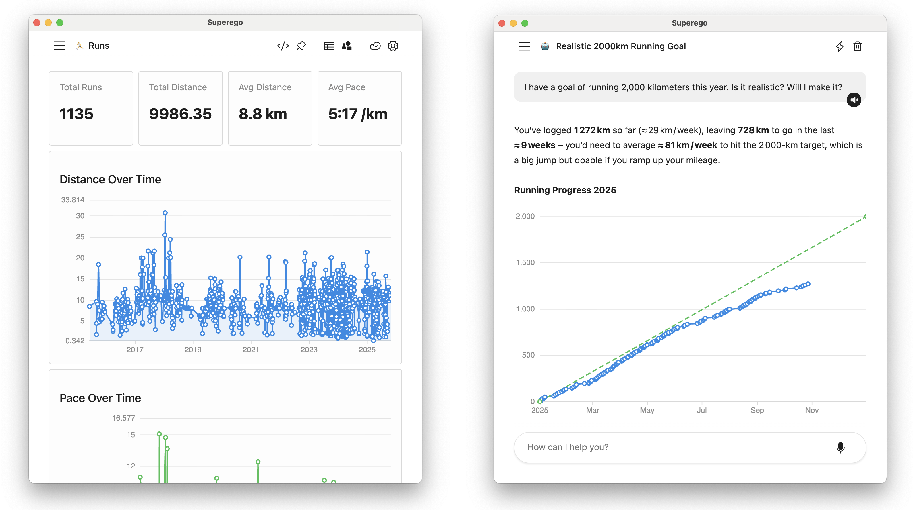

  

# Superego: Your Life's Database

Superego is a personal database app where you can store anything you want about
your life. Notes, tasks, meals, expenses, health logs... Whatever you want,
really; you define what goes in it.

Your data is stored locally, in a SQLite file you own and that you can backup
and sync with Dropbox, Google Drive, or whichever service you already use. No
accounts, no middlemen.

On top of this, Superego gives you two main functionalities:

1. An AI assistant that you can use to collect and explore your data.
2. A platform to build small personal applications that use that data.

## License

Unless otherwise specified, all files in this repository are licensed under the
**GNU Affero General Public License, Version 3 or later (AGPL-3.0-or-later)**.

You can find a copy of the full license text in the `LICENSE` file at the root
of this repository.

## Contributing

Check the [docs/setup.md](./docs/setup.md) for instructions on how to setup your
local dev environment.
