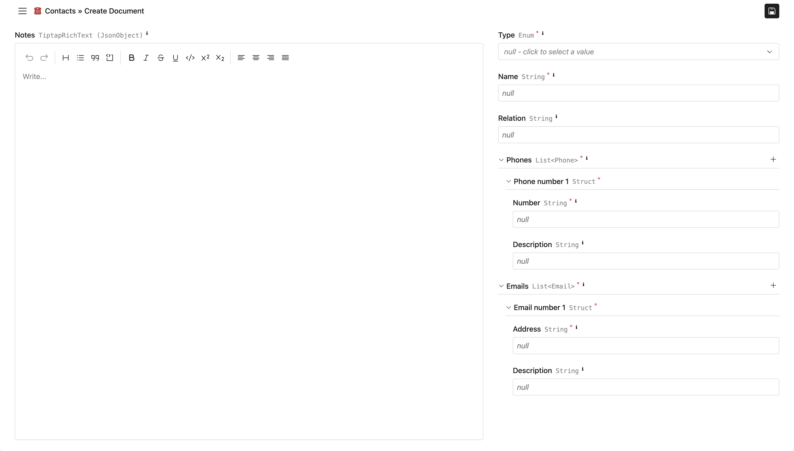

To customize how the document form looks when viewing or editing documents, you
can configure the collection's **default document view UI options** (_Collection
settings_ -> _Version settings_ tab):

```json
{
  /** Use the full width of the main panel content. */
  "fullWidth": true,
  /** Always collapse the primary sidebar (like it does on mobile). */
  "alwaysCollapsePrimarySidebar": true,
  /**
   * Responsive root layout. Keys are CSS media feature expressions.
   * See [Responsive root layout](#responsive-root-layout) below.
   */
  "rootLayout": {
    "(min-width: 65rem)": [],
    "all": []
  }
}
```

## Layout

A **layout** is an array of nodes that controls how fields are arranged inside a
Struct. Each node is either a **Field Node** (renders a schema field) or a **Div
Node** (a container for other nodes, basically a simple AST for an HTML
`<div>`).

If no layout is provided for a Struct, Superego renders its fields in the order
they appear in the schema, stacked vertically.

### Field Node

A **Field Node** references a property in the schema and renders it.

```json
{
  /**
   * Required. Path to a property in the schema (e.g. "myProp", "myList.$",
   * "myList.$.myProp").
   */
  "propertyPath": "myProp",
  /** Nested layout. Only applies to Struct fields. */
  "layout": [],
  /**
   * Hides the label section of the field. Defaults to false. Warning: the label
   * can contain controls (e.g. "nullify" or "add" buttons).
   */
  "hideLabel": false,
  /**
   * Whether the field can be collapsed. Only applies to Struct and List fields.
   * Defaults to true.
   */
  "allowCollapsing": true,
  /**
   * Makes the field flex-grow its height to fill all available space. Defaults
   * to false.
   */
  "flexGrow": false
}
```

### Div Node

A **Div Node** is a generic container. Use it to group fields and apply CSS
styles, for example to create multi-column layouts with flexbox.

```json
{
  /** CSS properties (same as React's CSSProperties). */
  "style": {},
  /** Nested layout nodes. */
  "children": []
}
```

### Available CSS variables

Superego sets a few CSS custom properties on the document form container. You
can reference them in Div Node `style` values via `var(...)`.

```css
/**
 * Height of the visible area in which the document form is rendered. Useful for
 * defining "sticky" layouts.
 */
--visible-area-height

/** Distance from the top of the viewport to the top of the visible area. */
--visible-area-top

/** Standard vertical gap to use between sections. */
--section-vertical-gap

/** Standard horizontal gap to use between sections. */
--section-horizontal-gap

/** Standard vertical gap to use between fields. */
--field-vertical-gap

/** Standard horizontal gap to use between fields. */
--field-horizontal-gap
```

## Responsive root layout

`rootLayout` is an object whose keys are
[CSS media feature expressions](https://developer.mozilla.org/en-US/docs/Web/CSS/@media#media_features)
and whose values are layouts. At runtime, the first matching expression wins
(evaluated in insertion order).

Use `"all"` as a catch-all fallback (it always matches). Place it last so that
more specific expressions are checked first.

| Key                    | Meaning                                          |
| ---------------------- | ------------------------------------------------ |
| `"(min-width: 65rem)"` | Matches when the viewport is at least 65rem wide |
| `"(min-width: 45rem)"` | Matches when the viewport is at least 45rem wide |
| `"all"`                | Always matches (fallback)                        |

### Layout example

A responsive two-column layout: on wide screens the left column is a sticky
notes editor and the right column lists the remaining fields. On narrow screens,
all fields are stacked vertically.

```json
{
  "fullWidth": true,
  "alwaysCollapsePrimarySidebar": true,
  "rootLayout": {
    "(min-width: 65rem)": [
      {
        "style": {
          "display": "grid",
          "gridTemplateColumns": "5fr 3fr",
          "columnGap": "var(--section-horizontal-gap)",
          "height": "100%"
        },
        "children": [
          {
            "style": {
              "position": "sticky",
              "height": "var(--visible-area-height)",
              "top": "var(--visible-area-top)",
              "display": "flex",
              "flexDirection": "column",
              "gap": "var(--field-vertical-gap)"
            },
            "children": [{ "propertyPath": "notes", "flexGrow": true }]
          },
          {
            "style": {
              "display": "flex",
              "flexDirection": "column",
              "gap": "var(--field-vertical-gap)"
            },
            "children": [
              { "propertyPath": "type" },
              { "propertyPath": "name" },
              { "propertyPath": "relation" },
              { "propertyPath": "phones" },
              { "propertyPath": "emails" }
            ]
          }
        ]
      }
    ],
    "all": [
      { "propertyPath": "type" },
      { "propertyPath": "name" },
      { "propertyPath": "relation" },
      { "propertyPath": "phones" },
      { "propertyPath": "emails" },
      { "propertyPath": "notes" }
    ]
  }
}
```

Result (wide screen):


